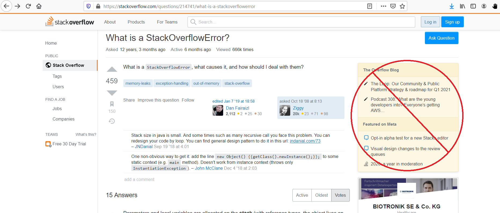
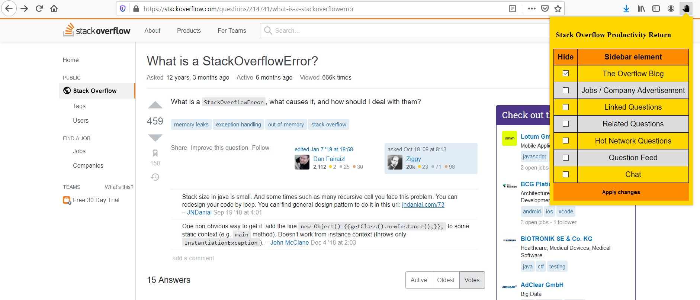

<h1 align="center">StackOverflowProductivityReturn</h1>

*No more distractions. Increase your productivity by only allowing specific elements on the StackOverflow sidebar. Or show none at all. You choose.*

## Overview
StackOverflowProductivityReturn is a Firefox extension that lets you hide a selection of or all sidebar elements on question pages on [Stackoverflow](https://stackoverflow.com/).

StackOverflowProductivityReturn is aimed at users who get easily distracted and want to maintain their productivity when looking up questions on Stackoverflow.

## Basic Usage
\

The image above shows the layout of the StackOverflowProductivityReturn Extension. Select sidebar elements you want to hide on StackOverflow question pages via click on the corresponding checkbox. Subsequently, apply your changes by clicking on `Apply changes`. When clicking on `Apply changes` the current site gets reloaded and the popup gets closed.

## Installation Instructions

### Firefox
You can get the latest version of StackOverflowProductivityReturn Extension from the [Mozilla Add-ons website].

#### Firefox install from source

1. Create a build directory with `mkdir build`
2. Extract the resulting zip file. You should see a `manifest.json` which will be used later.
3. In Firefox, first make sure there isn't an existing StackOverflowProductivityReturn add-on already installed
4. type `about:debugging` in the Address bar and enter.
5. Click on "This Firefox" then click "Load Unpackaged Extension"
6. Select the `manifest.json` file produced earlier.

## Contributing - Pull Requests
PRs are welcome.
- Star this GitHub repo
- Post about it on your social media (Twitter / Blogs / Facebook / Instagram etc)
- Create pull requests, submit bugs, suggest new features or documentation updates

## Disclaimer
* This software is provided for educational purposes only and
is provided "AS IS", without warranty of any kind, express or
implied, including but not limited to the warranties of merchantability, fitness for a particular purpose and noninfringement. In no event shall the authors or copyright holders be liable for any claim, damages or other liability, whether in an action of contract, tort or otherwise, arising from, out of or in connection with the software or the use or other dealings in the software.
